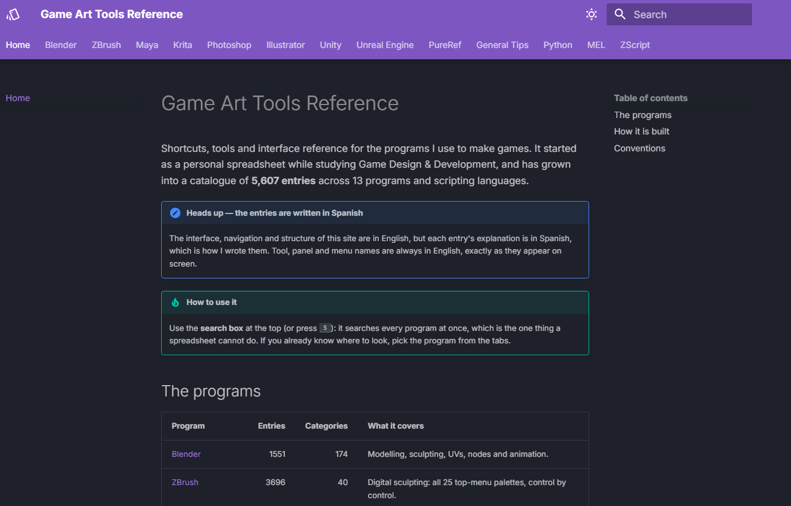
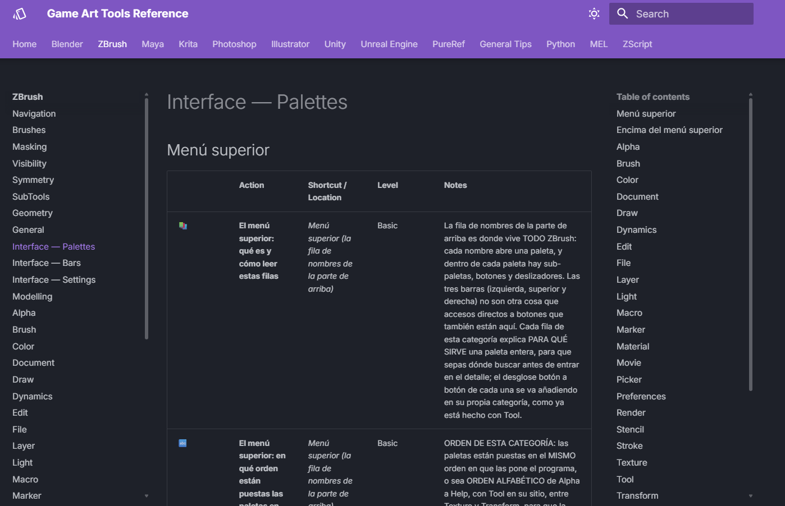

# Game Art Tools Reference

Shortcuts, tools and interface reference for the programs I use to make games —
Blender, ZBrush, Maya, Krita, Photoshop, Illustrator, Unity, Unreal Engine and
PureRef, plus the Python, MEL and ZScript scripting languages.

### 🔗 [Read it here → alexandralopezornaca23.github.io/Game-Designer-s-Guide](https://alexandralopezornaca23.github.io/Game-Designer-s-Guide)

**5,607 entries**, searchable across every program at once.



> The site is in English; each entry's explanation is written in Spanish.
> Tool, panel and menu names are always in English, exactly as they appear on
> screen.

---

## Why this exists

I started this spreadsheet for myself, as notes taken during my classes at
university. It outgrew that quickly. What I was writing down was going to be
just as useful to my classmates and to the people around me working in this
field, so I kept going and built it into something I could actually hand to
someone else.

Then I found out that large studios keep their own internal wikis for exactly
this kind of knowledge, and that changed what the project was. My goal is to
found my own game studio, and this is a first version of the documentation I
would want that studio to have. It is also why it stopped being a spreadsheet:
a site can be shared, searched and eventually contributed to — the plan is a
suggestions page where the people using it propose new entries, corrections and
improvements.

The official manuals are the other half of the answer. They exist, but finding
one specific thing inside them is slow, and every program keeps its own in its
own format. Writing my own and having all of them in one place turned out to be
faster than searching theirs.

**One row per slider, not one per tool.** This was ambitious on purpose. I
wanted a record of every function in every program — each tool, each button,
each slider — so that the answer to *"if I ever need this, how am I supposed to
use it?"* is already written down before I need it. It is the reason there are
5,607 entries instead of a few hundred, and the reason the number keeps growing.

---

## What's inside

| Program | Entries | Status |
|---|---:|---|
| **Blender** | 1,551 | Full interface — modelling, sculpting, UVs, nodes, animation. 174 categories |
| **ZBrush** | 3,696 | Full interface — all top-menu palettes, control by control |
| Maya | 70 | Shortcuts and essentials; full interface pending |
| Krita | 66 | In progress |
| Photoshop | 40 | Shortcuts and essentials; full interface pending |
| Illustrator | 35 | Shortcuts and essentials; full interface pending |
| PureRef | 35 | Shortcuts and board handling |
| Unity | 29 | Shortcuts and essentials; full interface pending |
| Unreal Engine | 28 | Shortcuts and essentials; full interface pending |
| General Tips | 16 | Workflow, file organisation, portfolio practices |
| Python | 26 | Scripts for Blender (`bpy`) and Maya (`maya.cmds`) |
| MEL | 9 | Scripts in Maya's native language |
| ZScript | 6 | ZBrush's own macro language |

Every entry carries its location in the interface, a difficulty level and an
explanation of what the control actually does:



---

## How it works

Everything comes from one file: **`GuiaGameDesigner.xlsx`**. That is the only
thing edited by hand. The rest is generated:

```
GuiaGameDesigner.xlsx  ──►  generate.py  ──►  docs/*.md + mkdocs.yml  ──►  mkdocs build  ──►  site/
```

`generate.py` reads every sheet, detects the columns from their header row
(by name, not by position, so it survives columns being added or moved), groups
the rows by category and writes one page per category, plus a per-program index
and the home page. Category names written in Spanish are translated for the
navigation through a lookup table; anything not in that table falls through
unchanged, so a new category never breaks the build.

The scripting sheets (Python, MEL, ZScript) are published as code blocks rather
than tables.

## Design decisions

A few choices that are deliberate rather than accidental:

**The spreadsheet is the source, not a database.** The editing tool matters more
than the storage format. I work in this file daily, with filters and conditional
formatting; a database would have meant building an editor before I could write
a single entry. The `.xlsx` lives in the repository, so it is versioned too.

**Columns are detected by name, not position.** I add and move columns as the
content grows — a "Palette" column appeared halfway through ZBrush, shifting
everything to its right. With fixed indices the site would have silently
rendered every field one column off.

**`docs/` is deleted and rebuilt on every run.** Running the generator twice
gives exactly the same result, and a category removed from the spreadsheet
really disappears instead of leaving an orphan page behind. Hand-maintained
files are listed in `PRESERVE` so the wipe does not take them with it.

**English tool names, Spanish explanations.** Every tool, panel and menu name is
written exactly as it appears on screen — in English, because that is how I run
these programs and how almost every interface ships. Translating them would make
them impossible to find. The explanations are in Spanish because it is my first
language and this began as a guide for myself. That split is a starting point,
not the end state: multiple language versions are planned.

## Publishing a change

1. Edit `GuiaGameDesigner.xlsx`.
2. Push to `main`.
3. The GitHub Action regenerates and publishes. `docs/` is never edited by hand.

## Running it locally

```bash
pip install -r requirements.txt
python generate.py     # rebuild docs/ and mkdocs.yml from the spreadsheet
mkdocs serve           # http://127.0.0.1:8000 with live reload
```

## Layout

| Path | What it is |
|---|---|
| `GuiaGameDesigner.xlsx` | The source. The only file edited by hand. |
| `generate.py` | The generator. |
| `mkdocs.yml` | Generated by `generate.py` — edit the template inside the script, not this file. |
| `docs/` | Generated Markdown. **Do not edit**: it is rebuilt on every run. |
| `docs/assets/` | Stylesheet, favicon and screenshots. Hand-maintained; survives regeneration. |
| `.github/workflows/deploy.yml` | Builds and publishes to GitHub Pages. |

## Status

This is an ongoing project, not a finished one.

**Blender and ZBrush are done** — presentable as they stand, though I expect to
keep adding to them whenever working on something turns up a gap. Between them
they account for 5,247 of the 5,607 entries.

**Krita is in progress.** Maya, Photoshop, Illustrator, Unity and Unreal Engine
currently cover shortcuts and essentials only; their full interfaces are still
ahead. 3ds Max and Marmoset Toolbag are planned but not started.

Entries marked **PENDIENTE** (*pending*) are deliberate: something I have not yet
confirmed against the program itself. I would rather flag a gap than invent an
answer.

## License

The **content** — every entry, explanation and note — is published under
[Creative Commons Attribution 4.0](https://creativecommons.org/licenses/by/4.0/).
Use it, adapt it and build on it, including commercially, as long as you credit
me.

The **code** — `generate.py` and the build configuration — is MIT.

---

Built by **Alexandra López Ornaca**, fourth-year Game Design & Development
student at Universidad Europea de Madrid.

More of my work: [alexandralopezornaca23.github.io](https://alexandralopezornaca23.github.io/)